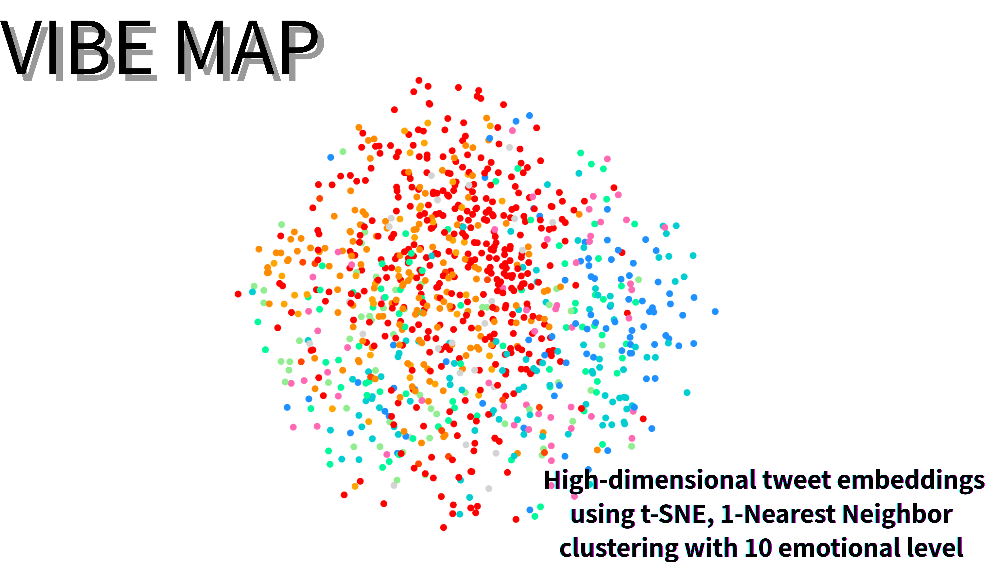
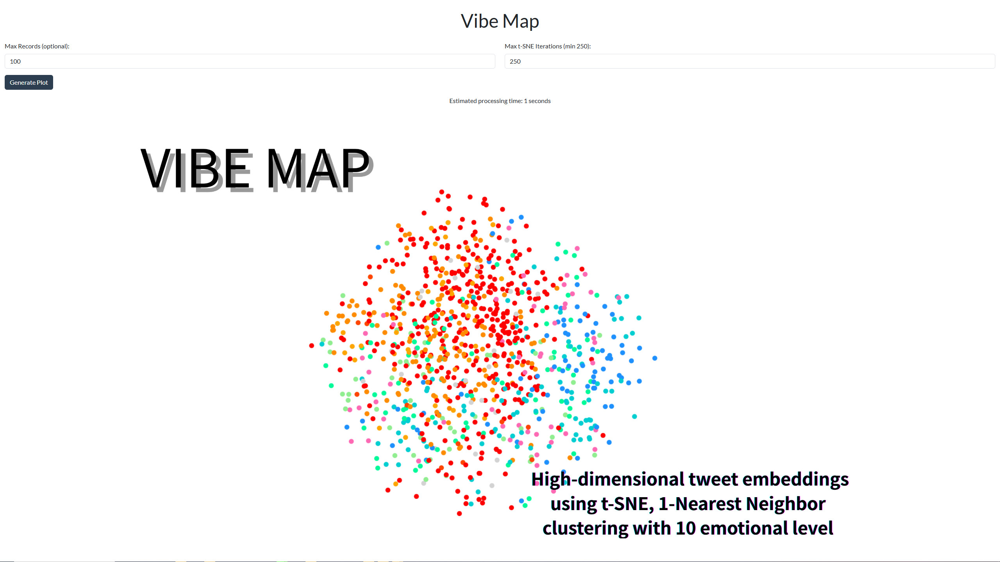
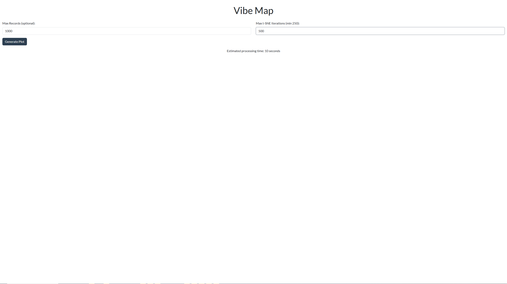
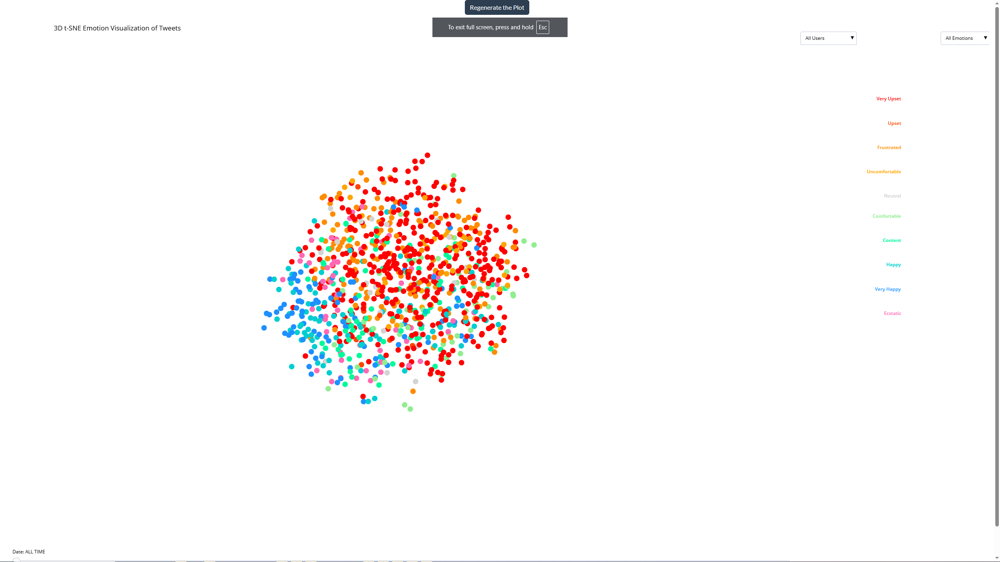

# 🌐VibeMap

**VibeMap** This project visualizes high-dimensional tweet embeddings using t-SNE, 1-Nearest Neighbor clustering using 10 emotional level, and interactive Plotly 3D scatter plots. It enables users to explore tweet data by username and time through dropdown filters and a time-range slider.    

---

## Demo & Features
### Configure Parameters - Recalcurate based on the value on real time -

> n the controls page, you can adjust:
> Max Records (optional): The number of records (or documents) to load.
> Max t-SNE Iterations (min 250): The number of iterations for t-SNE processing.
> As you change these values, the estimated processing time is recalculated live.
### Generate the Plot

> Click the Generate Plot button to begin processing:
> Countdown timer appear below the estimated time.
> Once the countdown completes, the interactive 3D plot is generated.
> The plot is displayed in full screen.
###  Interact with the Visualization

> Explore the Plot:
> Use your mouse to rotate, zoom, and pan the 3D scatter plot.
> Time Navigation: Use the embedded slider to move between different animation frames (time segments).
> Regenerate the Plot:
> To adjust parameters or generate a new plot, click the Regenerate the Plot button (located at the top center of the plot page) to reset the view and return to the controls.
### [Live Demo (Light Webbrowser Version)](https://yutomorimori.com/vibemap-live-demo.html)
- for Full version install over DockerHub or follow the Setup below
---

---

## ⚙️ Setup
### 1. Download the DataSet:
### [Download 1.6M tweets on Kaggle](https://www.kaggle.com/datasets/yutomori2/1-6-million-tweets)

### 2. Install Python packages:
```bash
pip install -r requirements.txt
```

### 3. Define environment/config values
Edit and Review `config.py`:
```python
# config.py
MONGO_URI =  "mongodb://localhost:27017/" # Default to localhost if not set
DB_NAME = "visualization_db"
DOCUMENT_PATH="./Data/document/tweets.csv" # You can change this to the path of your Data
COLLECTION_NAME = "Tweeter_embedding_collection" # You can change this to the name of your collection.
DOCUMENT_TYPE = "Tweets" # You can change this to the type of document you are using.
EMOTIONAL_LEVEL_COLLECTION = "Emotion_Level_Mapping"
# Mapping from cluster number to its corresponding emotion label.
EMOTION_LABELS = {
    0: "Very Upset",        # Extreme negative
    1: "Upset",             # Strong negative
    2: "Frustrated",        # Irritated but less intense than 'Upset'
    3: "Uncomfortable",     # Mildly negative
    4: "Neutral",           # Neither negative nor positive
    5: "Comfortable",       # Mildly positive
    6: "Content",           # Peaceful and satisfied
    7: "Happy",             # Actively positive
    8: "Very Happy",        # Strong joy
    9: "Ecstatic"           # Extreme joy, elation
}
EMOTION_COLOR_MAP = {
    "Very Upset": "#FF0000",       # Intense Red
    "Upset": "#FF4500",            # Orange Red
    "Frustrated": "#FF8C00",       # Dark Orange
    "Uncomfortable": "#FFA500",    # Orange
    "Neutral": "#D3D3D3",          # Light Gray
    "Comfortable": "#90EE90",      # Light Green
    "Content": "#00FA9A",          # Medium Spring Green
    "Happy": "#00CED1",            # Dark Turquoise
    "Very Happy": "#1E90FF",       # Dodger Blue
    "Ecstatic": "#FF69B4"          # Hot Pink
}
COLLECTION = [{
    "db_name": DB_NAME,
    "embedding_collection_name": COLLECTION_NAME, # You can rename this based on the document type.
    "document_type": DOCUMENT_TYPE # You can change this to the different document types you have.
}]

```

---

## 🚀 How to Run

### Step 1: Ingest Data into MongoDB
```bash
python -m preprocess.ingest_Data
```
- Loads tweets from CSV
- Removes NaNs and duplicate tweets
- Creates index on `tweets`

### Step 2: Add or Update Embeddings
```bash
python -m preprocess.update_embedding
```
- Computes embeddings using OpenAI API
- Updates MongoDB documents in-place
### Step 3: Insert Emotional Level on MongoDB
```bash
python -m preprocess.insert_emotional_level
```
- Creates embedding collection of 10 type of emotions on MongoDB
### Step 4: Using compute Cosine Simirarity, and return the closest emotions
```bash
python -m preprocess.assign_emotins
```
- Creates new collection that contains tweets and assigned emotions on MongoDB tha will be used on tsne

### Step 5 a: Launch Visualization
```bash
python -m visualize.plot_tsne_3d
```
- Loads embeddings and metadata
- Runs PCA + t-SNE
- Launches browser with interactive Dash view

####  Features
- `Data Loading & Preprocessing`: Connects to a MongoDB database to load tweets (or documents) with high-dimensional embeddings. The data is preprocessed using PCA and t‑SNE for effective dimensionality reduction before visualization.
- `Dropdown`: Filter the visualization by username using a dropdown menu, making it easy to explore data for individual users.
- `Estimated Processing Time`:
The application calculates an estimated processing time using the formula computed = ceil((limit / 10000) * (max_itr / 5)).
As you adjust the input parameters, the estimated time is dynamically updated and displayed. When you generate the plot, a countdown timer and a loading spinner appear to simulate processing, and if the countdown reaches zero, a message notifies you that finalizing the plot may take additional time.
- `Regenerating the plot`:On the plot view, a "Regenerate the Plot" button is provided at the top center. Clicking this button resets the interface, bringing you back to the controls page so you can adjust parameters, recalculate the estimated processing time, and generate a new visualization.
- `Dropdown`: filter by `username`
- `Slider`: filter by `tweets_time`
- `Hover`: view tweet content, t-SNE info, and cluster
- `Clusters`: 1-Nearest Neighbor method. with 10 color-coded groups
### Step 5 b: Launch Visualization **(light version)**
```bash
python -m visualize.plotly_tsne_3d
```
- Loads embeddings and metadata
- Runs PCA + t-SNE
- Launches browser with interactive Plotly view
####  Features

- `Dropdown`: filter by `username`
- `Slider`: filter by `tweets_time`
- `Hover`: view tweet content, t-SNE info, and cluster
- `Clusters`: 1-Nearest Neighbor method. with 10 color-coded groups

---


---

## 📁 Directory Structure
```bash
VibeMap/     
├── preprocess/                        #  Preprocessing scripts for data ingestion and clustering
│   ├── ingest_Data.py                #    Loads or scrapes raw data (e.g., tweets, documents)
│   ├── assign_emotions.py            # Creates embedding collection of 10 type of emotions on MongoDB
│   ├── insert_emotional_level.py       #    Creates new collection that contains tweets and assigned emotions on MongoDB 
│   └── update_embedding.py           #   - Updates MongoDB or files with newly generated embeddings
│
├── visualizations/                   #  Scripts for plotting and exploring embeddings
│   ├── __init.py__                   #   - Marks this as a Python package (may be empty or setup logic)
│   ├── ploty_tsne_3d.py               #   Plots embeddings interactively ( 3D, Plotly using t-sne and pca)
│   └── plot_tsne_3d.py                #   Plots embeddings interactively using Dash full version
│
├── Data/                             #  Raw and generated data used in the pipeline
│   ├── document/tweets.csv           #   - Original dataset with tweet texts or metadata
│   ├── assets/logo.png           #   - Image used in README or docs (e.g., for GitHub preview)
│   └── visualizations_outputs/       #   - Auto-generated HTML or plots from t-SNE/K-Means results
│
├── docker/                           #  Docker-related files for containerization
│   ├── Dockerfile                    #   - Defines environment and dependencies for the app
│   └── docker-compose.yml            #   - Coordinates multi-container setups (e.g., app + MongoDB)    
│
├── .gitignore                        #  Specifies files/folders to ignore in Git version control
├── config.py                         #  Configuration (e.g., MongoDB URI, DB names, collection names)
├── LICENSE                           #  Open-source license for the project
├── requrements.txt                   #  List of Python dependencies (for pip install)
└── README.md                         #  Project overview, setup instructions, usage examples
```

---

---
## MongoDB Document Example
```bash
_id:67fddaf77044318b3836161b
index:5
title:"Tweet by 2Hood4Hollywood at Mon Apr 06 22:20:05 PDT 2009"
tweets:"@Tatiana_K nope they didn't have it "
username:"2Hood4Hollywood"
timestamp:"Mon Apr 06 22:20:05 PDT 2009"
embeddings:Array (384)
emotion_details:
    assigned_cluster: 2
    EMOTION_LABELS:"Frustrated"
    EMOTION_COLOR:"#FF8C00"
```


## 🐳 Docker Support
### Pull
```
docker pull micelytech/vibemap:latest
```

### Run
```
docker run -it micelytech/vibemap:latest
```
### Build and Run
```bash
cd docker
docker build -t vibemap .
docker run --rm vibemap
```

- Make sure MongoDB is running and reachable from the container.

---

## 👤 Author
Created by [Yuto Mori @ Micelytech](https://yutomorimori.com)  

