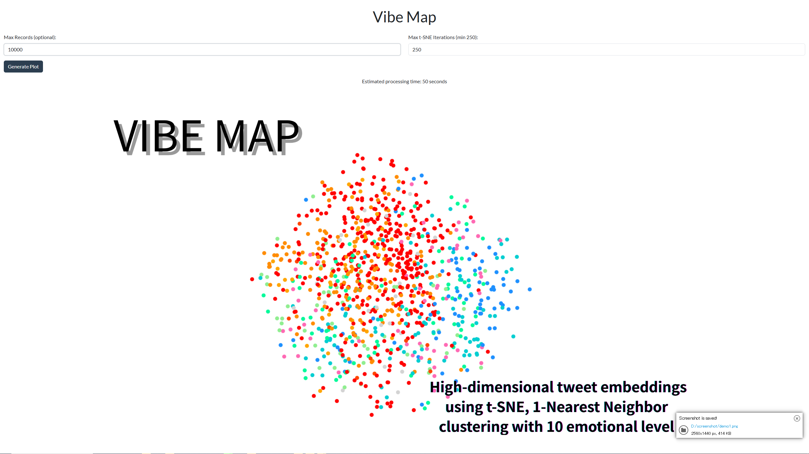

# 🌐VibeMap
**VibeMap** VibeMap is an open-sourced sentiment-aware tweet visualizer that performs a scalable sentiment analysis tool that visualizes tweet embeddings in 3D using t-SNE and emotional clustering. This project explores transformer-free encoding pipelines that drastically improve cost-efficiency, training time, and scalability without sacrificing accuracy. It serves as a testbed for research into semi-supervised emotion classification and lightweight sentiment encoding.
---


## 🚀 Live Demo & Core Features

### 1. Configure Parameters  
  
- **Max Records** (optional): number of tweets to load  
- **Max t-SNE Iterations** (min 250)  
- **Estimated Time** recalculates live as you change parameters

### 2. Generate the Plot  
  
- Click **Generate Plot**  
- Countdown timer appears below the estimate  
- When countdown finishes, full‑screen 3D plot is rendered

### 3. Interact with the Visualization  
  
- **Rotate, zoom, pan** with your mouse  
- **Time slider** animates between time segments  
- **Regenerate**: use the top‑center button to return to controls

👉 [Light Browser Demo](https://yutomorimori.com/vibemap-live-demo.html)  
For the full version, install via Docker or follow the Setup below.

---

## 🐳 Docker Support
### Pull
```
docker pull micelytech/vibemap:latest
```

### Run
```
docker run -it micelytech/vibemap:latest
```
### Build and Run
```bash
cd docker
docker build -t vibemap .
docker run --rm vibemap
```

- Make sure MongoDB is running and reachable from the container.
---

---

## ⚙️ Setup
### 1. Download the DataSet:
### [Download 1.6M tweets on Kaggle](https://www.kaggle.com/datasets/yutomori2/1-6-million-tweets)

### 2. Install Python packages:
```bash
pip install -r requirements.txt
```

### 3. Define environment/config values
Edit and Review `config.py`:
```python
# config.py
MONGO_URI =  "mongodb://localhost:27017/" # Default to localhost if not set
DB_NAME = "visualization_db"
DOCUMENT_PATH="./Data/document/tweets.csv" # You can change this to the path of your Data
COLLECTION_NAME = "Tweeter_embedding_collection" # You can change this to the name of your collection.
DOCUMENT_TYPE = "Tweets" # You can change this to the type of document you are using.
EMOTIONAL_LEVEL_COLLECTION = "Emotion_Level_Mapping"
LABEL_COLLECTION="Manually_Labeled_Emotions"
# Mapping from cluster number to its corresponding emotion label.
EMOTION_LABELS = {
    0: "Very Upset",        # Extreme negative
    1: "Upset",             # Strong negative
    2: "Frustrated",        # Irritated but less intense than 'Upset'
    3: "Uncomfortable",     # Mildly negative
    4: "Neutral",           # Neither negative nor positive
    5: "Comfortable",       # Mildly positive
    6: "Content",           # Peaceful and satisfied
    7: "Happy",             # Actively positive
    8: "Very Happy",        # Strong joy
    9: "Ecstatic"           # Extreme joy, elation
}
very_upset_synonyms = [
    "incensed", "infuriated", "enraged", "irate", "fuming", "seething", "livid", 
    "indignant", "outraged", "exasperated", "apoplectic", "choleric", "wrathful",
    "maddened", "boiling", "raging", "heated", "stirred", "vexed", "rankled",
    "frustrated", "tormented", "agitated", "irritated", "annoyed", "cross",
    "resentful", "bitter", "peeved", "pissed", "up in arms", "steamed", "burning",
    "angsty", "hostile", "provoked", "incendiary", "mad", "beside oneself",
    "worked up", "fit to burst", "gritting teeth", "simmering", "explosive",
    "volatile", "ticked off", "fed up", "writhing", "boiled over", "storming",
    "gnashing", "displeased", "nettled", "discontented", "harrowed", "disgruntled",
    "frayed", "fiery", "ill-tempered", "sore", "snapping", "ranting", "blazing",
    "fierce", "acrimonious", "clamorous", "spiteful", "irascible", "caustic",
    "pugnacious", "incendiary", "distempered", "tense", "uptight", "cranky",
    "riled up", "combative", "bad-tempered", "bubbling", "on edge", "exploding",
    "vehement", "bristling", "impassioned", "stormy", "troubled", "disturbed",
    "frantic", "clammy", "shaken", "tempestuous", "sizzling", "unhinged",
    "perturbed", "unsettled", "pressured", "wrangled", "beset", "boiling mad"
]

ecstatic_synonyms = [
    "elated", "overjoyed", "exhilarated", "euphoric", "rapturous", "jubilant", 
    "exultant", "rhapsodic", "thrilled", "blissful", "in seventh heaven", 
    "on cloud nine", "radiant", "uplifted", "delighted", "enraptured", "transported",
    "gleeful", "buoyant", "beaming", "ecstatic", "cheerful", "lighthearted", 
    "walking on air", "sunny", "tickled pink", "jumping for joy", "joyful", 
    "merry", "rejoicing", "contented", "grinning", "glowing", "bubbling over",
    "in rapture", "giddy", "over the moon", "bursting with joy", "high-spirited",
    "beatifically happy", "deliriously happy", "sky-high", "floating", "upbeat",
    "festive", "overexcited", "celebratory", "in ecstasy", "vibrant", "radiating joy",
    "hopped up", "eager", "enchanted", "tickled", "smitten", "spellbound",
    "entranced", "spellbound", "zestful", "heartened", "vivacious", "buoyed",
    "grateful", "gratified", "fulfilled", "charmed", "ecstatically moved",
    "passionately happy", "animated", "full of life", "on top of the world",
    "carried away", "beyond happy", "gleaming", "dreamy", "exalted", "warm-hearted",
    "energetic", "hopeful", "flushed with joy", "laughing inside", "positively glowing",
    "content", "serene", "soaring", "cheery", "like a kid on Christmas", "stoked",
    "loving life", "zippy", "zingy", "effervescent", "sparkling", "sunbeam-like",
    "touched", "buzzing", "in bliss", "sweetly joyful", "bright-eyed", "flushed with happiness"
]
frustrated_synonyms = [
    "exasperated", "discontented", "disheartened", "irked", "miffed", "aggravated", 
    "vexed", "stymied", "disappointed", "disillusioned", "annoyed", "fed up",
    "bothered", "displeased", "discouraged", "let down", "bummed", "soured",
    "dissatisfied", "perturbed", "inhibited", "upset", "restless", "resigned",
    "unfulfilled", "impatient", "inconvenienced", "disgruntled", "blocked", 
    "baffled", "irritated", "distressed", "burned out", "cranky", "tense", 
    "agitated", "uneasy", "muddled", "resentful", "confounded", "in turmoil", 
    "unsatisfied", "thwarted", "worn down", "wound up", "on edge", "edgy", 
    "disoriented", "cornered", "deadlocked", "caught up", "jammed", "bogged down",
    "hindered", "paralyzed", "balled up", "throttled", "discouraged", "fatigued",
    "flustered", "jittery", "testy", "irate", "bristly", "cross", "short-tempered",
    "burdened", "wary", "pressured", "troubled", "nagged", "dragged", "in limbo",
    "unsettled", "unsure", "conflicted", "rattled", "defeated", "strained",
    "challenged", "emotionally blocked", "under pressure", "bent out of shape",
    "not at ease", "mentally stuck", "going in circles", "running into walls",
    "emotionally drained", "struggling", "not progressing", "feeling stuck",
    "caught in a bind", "spinning wheels", "going nowhere", "clogged", "jammed up",
    "emotionally jammed", "mentally blocked", "unable to focus", "irritably stagnant"
]
upset_synonyms = [
    "annoyed", "displeased", "agitated", "irritated", "vexed", "disturbed", 
    "perturbed", "offended", "disgruntled", "miffed", "rankled", "riled", 
    "discomposed", "troubled", "unsettled", "shaken", "uneasy", "disconcerted",
    "worried", "bothered", "resentful", "sensitive", "afflicted", "pained",
    "sulky", "grumpy", "fretful", "gloomy", "sullen", "low-spirited",
    "moody", "glum", "melancholy", "blue", "dejected", "downcast",
    "pensive", "distraught", "grouchy", "in a funk", "crestfallen",
    "discomfited", "restless", "jumpy", "touchy", "unhappy", "off-kilter",
    "out of sorts", "tetchy", "edgy", "defensive", "reactive", "huffy",
    "insecure", "doubtful", "despondent", "troubled", "dismayed", "downhearted",
    "hurt", "alienated", "tense", "tight-chested", "aloof", "withdrawn",
    "rejected", "forgotten", "disregarded", "overlooked", "criticized",
    "slighted", "ignored", "snubbed", "sensitive", "pressured", "fatigued",
    "drained", "burned out", "uncertain", "inward", "anxious", "hesitant",
    "disoriented", "disengaged", "lonely", "out of place", "emotionally raw",
    "overwhelmed", "restive", "emotional", "discouraged", "demoralized",
    "affronted", "saddened", "detached", "uneasy", "fidgety", "exhausted",
    "yearning", "with a heavy heart", "sensitive to criticism", "feeling off"
]
uncomfortable_synonyms = [
    "uneasy", "restless", "discomposed", "awkward", "dismayed", "troubled", 
    "perturbed", "disquieted", "disconcerted", "ill at ease", "anxious", "fidgety",
    "nervous", "jittery", "insecure", "tense", "self-conscious", "on edge",
    "unsettled", "off-balance", "disturbed", "timid", "flustered", "edgy",
    "stiff", "hesitant", "apprehensive", "shy", "rattled", "guarded", "uneasy feeling",
    "conflicted", "touchy", "squirmy", "uptight", "agitated", "panicky", "hesitant",
    "unconfident", "distressed", "stressed", "troubled", "embarrassed", "bashful",
    "overwhelmed", "tense-bodied", "hyperaware", "awkwardly positioned", "wary",
    "clumsy", "trapped", "misplaced", "coerced", "resistant", "unnerved", "numb",
    "repressed", "inhibited", "bothered", "shaken", "cringy", "unsteady",
    "defensive", "out of place", "not at ease", "out of comfort zone", "tight-lipped",
    "blank-faced", "tense-jawed", "closed-off", "emotionally stiff", "socially anxious",
    "hesitant to speak", "unsure", "awkward silence", "dodgy", "aggrieved", "oppressed",
    "emotionally raw", "vulnerable", "guarded expression", "cold sweat", "nervy",
    "shy around people", "averting eye contact", "inhibited body language", 
    "unnatural", "strained", "compelled", "emotionally exposed", "unnatural posture",
    "psychologically tense", "tied in knots", "sensitive", "timorous", "pushed out",
    "not relaxed", "emotionally tight", "frozen", "holding back"
]
neutral_synonyms = [
    "indifferent", "unemotional", "detached", "dispassionate", "apathetic", 
    "unbiased", "impassive", "nonchalant", "unaffected", "balanced", 
    "objective", "even-tempered", "calm", "cool", "collected", "composed",
    "reserved", "stoic", "restrained", "unflappable", "tranquil", "serene",
    "level-headed", "impartial", "disengaged", "matter-of-fact", "unmoved",
    "aloof", "inactive", "flat", "emotionless", "nonreactive", "indifferent-minded",
    "unsentimental", "toneless", "expressionless", "robotic", "neutral-faced",
    "steady", "low-affect", "relaxed", "non-expressive", "passive", "mild",
    "noncommittal", "middle-of-the-road", "blank", "cold", "lukewarm", "plain",
    "reserved in tone", "balanced-minded", "mediated", "uninterested",
    "level", "modest in tone", "calibrated", "measured", "deliberate",
    "equable", "nonaligned", "inactive emotionally", "standoffish", "remote",
    "subdued", "moderate", "nonpartisan", "apathetic in attitude", 
    "neither here nor there", "emotionally unavailable", "centered", "stable",
    "undemonstrative", "indecisive", "quiet", "toned-down", "inactive emotionally",
    "emotionally leveled", "cool-headed", "unswayed", "nonjudgmental", "factual",
    "data-driven", "unprejudiced", "calculated", "uninvolved", "withdrawn",
    "stoical", "emotionally flat", "neutral in tone", "rational", "non-intrusive",
    "moderate-minded", "without extremes", "measured tone", "undecorated",
    "non-exaggerated", "coolly analytical", "internally quiet"
]

comfortable_synonyms = [
    "at ease", "relaxed", "composed", "content", "secure", "cozy", "calm", 
    "soothed", "rested", "placid", "snug", "serene", "restful", "peaceful", 
    "untroubled", "tranquil", "easygoing", "laid-back", "undisturbed", "inviting",
    "pleasant", "agreeable", "enjoyable", "satisfying", "pleasing", "delightful",
    "warm", "toasty", "soft", "cushy", "plush", "spacious", "roomy", "commodious",
    "ample", "generous", "hospitable", "welcoming", "homely", "homey", "genial",
    "intimate", "easeful", "reposeful", "unperturbed", "unruffled", "unflappable",
    "carefree", "lighthearted", "blissful", "contented", "cheerful", "happy",
    "mellow", "breezy", "languid", "unhurried", "nonchalant", "casual", "informal",
    "friendly", "familiar", "safe", "sheltered", "protected", "secure", "sound",
    "stable", "settled", "complacent", "gratified", "fulfilled", "satiated",
    "sated", "well-off", "affluent", "prosperous", "wealthy", "well-to-do",
    "well-heeled", "luxurious", "lavish", "opulent", "sumptuous", "extravagant",
    "indulgent", "pampered", "spoiled", "cared for", "nurtured", "cherished",
    "valued", "appreciated", "respected", "esteemed", "admired", "loved",
    "adored", "treasured", "prized", "revered", "venerated", "idolized",
    "worshipped", "honored", "celebrated", "glorified", "exalted", "distinguished",
    "eminent", "renowned", "famous", "notable", "noteworthy", "prominent",
    "illustrious", "esteemed", "respected", "reputable", "prestigious", "acclaimed",
    "recognized", "acknowledged", "esteemed", "honored", "venerated", "revered"
]
content_synonyms = [
    "satisfied", "gratified", "fulfilled", "appeased", "settled", "pleased",
    "serene", "tranquil", "complacent", "at peace", "happy", "glad", "delighted",
    "cheerful", "untroubled", "comfortable", "unworried", "thankful", "relaxed",
    "placid", "at ease", "joyful", "blissful", "merry", "jovial", "gleeful",
    "tickled", "jolly", "elated", "blithe", "upbeat", "carefree", "chirpy",
    "sunny", "buoyant", "bubbly", "effervescent", "lighthearted", "jubilant",
    "ecstatic", "pleasant", "smiley", "beaming", "vivacious", "breezy", "calm",
    "perky", "grinning", "smiling", "positive", "hopeful", "lively", "sprightly",
    "appeased", "airy", "reassured", "peaceful", "convivial", "unhurried",
    "felicitous", "agreeable", "rejoicing", "hilarious", "rapturous", "restful",
    "protected", "snug", "proud", "comforted", "homely", "safe", "leisurely",
    "pleasing", "secure", "willing", "unruffled", "soothed", "easygoing",
    "chilled", "casual", "smug", "flying high", "walking on air", "cheering",
    "heartwarming", "together", "unfazed", "unflappable", "honored", "prideful",
    "esteemed", "dignified", "triumphant", "pleasurable", "sanguine", "rosy",
    "enjoyable", "fantastic", "high-spirited", "enraptured", "stoked", "bright",
    "winsome", "floating on air", "reassured", "assuaged", "peaceful", "genial",
    "jocund", "animated", "optimistic", "radiant", "sparkling", "chipper",
    "overjoyed", "gladsome", "thrilled", "exuberant", "bubbly", "jubilant",
    "tickled pink", "laughing", "light-hearted", "ebullient", "cheerful",
    "sunny", "blithesome", "bright", "sparkling", "chipper", "overjoyed",
    "radiant", "buoyant", "in high spirits", "gladsome", "thrilled", "exuberant",
    "bubbly", "genial", "jocund", "effervescent", "lighthearted", "happy-go-lucky"
]
happy_synonyms = [
    "joyful", "cheerful", "merry", "delighted", "glad", "jolly", "sunny",
    "upbeat", "radiant", "smiling", "content", "pleased", "elated", "ecstatic",
    "jubilant", "gleeful", "lighthearted", "buoyant", "blissful", "euphoric",
    "exuberant", "jovial", "blithe", "satisfied", "overjoyed", "thrilled",
    "chipper", "chirpy", "beaming", "grinning", "bubbly", "vivacious",
    "carefree", "mirthful", "jocund", "exultant", "rapturous", "enraptured",
    "tickled", "tickled pink", "on cloud nine", "walking on air",
    "in seventh heaven", "floating on air", "over the moon", "beside oneself with joy",
    "as happy as a clam", "as happy as Larry", "as pleased as Punch",
    "like a dog with two tails", "blithesome", "gay", "beatific", "rosy",
    "sanguine", "sunny disposition", "heartwarming", "cheery", "festive",
    "genial", "jaunty", "sprightly", "ebullient", "breezy", "sparky",
    "bouncy", "airy", "positive", "high-spirited", "spirited", "happy-go-lucky",
    "jocular", "unworried", "transported", "entertaining", "jocose", "relaxed",
    "enthusiastic", "peart", "bright-eyed and bushy-tailed", "cheering",
    "full of the joys of spring", "of good cheer", "frisky", "elevated",
    "eupeptic", "lightsome", "canty", "in raptures", "energetic", "serene",
    "giddy", "hearty", "agreeable", "without a care in the world", "diverting",
    "full of vim and vigour", "vital", "bright and breezy", "gamesome",
    "enrapt", "funny", "easy", "heartening", "active", "heady", "friendly",
    "gratifying", "at peace", "on cloud seven", "snappy", "glorious", "placid",
    "celebratory", "festal", "frolic", "sent", "confident", "exalted",
    "full of hope", "zestful", "encouraging", "brisk", "beside oneself with happiness",
    "bouncing", "casual", "pleased as punch", "great", "animate", "golden",
    "facetious", "ludic", "amused", "promising", "tranquil", "jokey", "proud",
    "as merry as a grig", "satisfying", "auspicious", "delirious", "complacent",
    "flying", "full of life", "propitious", "hysterical", "heavenly", "pert",
    "appeased", "pizzazzy", "pizazzy", "comical", "uplifting", "springy",
    "kinetic", "jazzy", "comic", "fresh", "crazy", "mettlesome", "easy-going",
    "alert", "racy", "debonair", "calm", "nonchalant", "outgoing", "warm",
    "gloating", "zappy", "zingy", "zippy"
]
very_happy_synonyms = [
    "gleeful", "elated", "exuberant", "buoyant", "overjoyed", "ecstatic", 
    "blithe", "lively", "bubbly", "vivacious", "jubilant", "radiant", 
    "merry", "euphoric", "giddy", "cheerful", "sunny", "exultant", 
    "jolly", "delighted", "thrilled", "blissful", "chirpy", "bouncing", 
    "high-spirited", "beaming", "lighthearted", "joyful", "mirthful", 
    "laughing", "bright", "in high spirits", "on cloud nine", "tickled pink",
    "zippy", "zingy", "effervescent", "sparkling", "zestful", "chipper", 
    "smiling", "in seventh heaven", "walking on air", "festive", "exhilarated",
    "ecstatically happy", "buzzing", "elevated", "glowing", "heartfelt joy", 
    "over the moon", "bubbling with happiness", "full of joy", "perky", 
    "positively glowing", "enraptured", "animated", "cheery", "laughing aloud", 
    "sweetly joyful", "emotionally soaring", "bursting with joy", "grinning",
    "feeling fantastic", "starry-eyed", "high on life", "light as air", 
    "floating", "energized", "pumped", "contentedly joyful", "hyped", 
    "smiling from ear to ear", "all smiles", "exuberantly happy", 
    "can’t stop smiling", "radiating joy", "sunbeam-like", "bright-eyed",
    "deliriously happy", "happily glowing", "carefree", "vibrant", 
    "emotionally lit", "hyper-happy", "totally thrilled", "uplifted",
    "overcome with joy", "beatifically happy", "passionately cheerful", 
    "heartwarmingly happy", "in ecstasy", "ecstatic delight", 
    "boisterously happy", "elation-filled", "sky-high joy"
]


# Extended emotion lexicon combining all categories into a dictionary
EXTENDED_EMOTION_LABELS = {
    "Very Upset": very_upset_synonyms,
    "Upset": upset_synonyms,
    "Frustrated": frustrated_synonyms,
    "Uncomfortable": uncomfortable_synonyms,
    "Neutral": neutral_synonyms,
    "Comfortable": comfortable_synonyms,
    "Content": content_synonyms,
    "Happy": happy_synonyms,
    "Very Happy": very_happy_synonyms,
    "Ecstatic": ecstatic_synonyms,
}
EMOTION_COLOR_MAP = {
    "Very Upset": "#FF0000",       # Intense Red
    "Upset": "#FF4500",            # Orange Red
    "Frustrated": "#FF8C00",       # Dark Orange
    "Uncomfortable": "#FFA500",    # Orange
    "Neutral": "#D3D3D3",          # Light Gray
    "Comfortable": "#90EE90",      # Light Green
    "Content": "#00FA9A",          # Medium Spring Green
    "Happy": "#00CED1",            # Dark Turquoise
    "Very Happy": "#1E90FF",       # Dodger Blue
    "Ecstatic": "#FF69B4"          # Hot Pink
}
COLLECTION = [{
    "db_name": DB_NAME,
    "embedding_collection_name": COLLECTION_NAME, # You can rename this based on the document type.
    "document_type": DOCUMENT_TYPE # You can change this to the different document types you have.
}]
EMOTION_ASSIGNED_TWEETS_COLLECTION="emotion_assigned_tweets"

```

---

## 🚀 How to Run

### Step 1: Ingest Data into MongoDB
```bash
python -m preprocess.ingest_Data
```
- Loads tweets from CSV
- Removes NaNs and duplicate tweets
- Creates index on `tweets`

### Step 2: Add or Update Embeddings
```bash
python -m preprocess.update_embedding
```
- Computes embeddings using OpenAI API
- Updates MongoDB documents in-place
### Step 3: Insert Emotional Level on MongoDB
```bash
python -m preprocess.insert_emotional_level
```
- Creates embedding collection of 10 type of emotions on MongoDB
### Step 4: assign and label the emotions of tweets by human
```bash
python -m preprocess.insert_emotional_level
```
- Creates labled collection of 10 type of emotions based on tweets.
- More Data better Accuracy on this system.

### Step 5: Insert/update Emotional Level after compute cosine simirairty & supervised learning & unsupervised learning(k-means) on MongoDB
```bash
python -m preprocess.assign_emotins
```
- load the labeled data for training and evaluation split into 8:2.
- Stage 1: cosine similarity → nearest prototype
- Stage 2: weighted supervised learning
- Stage 3: K‑Means residual correction
- upserts final emotion_details into MongoDB

### Step 6 a: Launch Visualization
```bash
python -m visualize.plot_tsne_3d
```
- Loads embeddings and metadata
- Runs PCA + t-SNE
- Launches browser with interactive Dash view

####  Features
- `Data Loading & Preprocessing`: Connects to a MongoDB database to load tweets (or documents) with high-dimensional embeddings. The data is preprocessed using PCA and t‑SNE for effective dimensionality reduction before visualization.
- `Dropdown`: Filter the visualization by username using a dropdown menu, making it easy to explore data for individual users.
- `Estimated Processing Time`:
The application calculates an estimated processing time using the formula computed = ceil((limit / 10000) * (max_itr / 5)).
As you adjust the input parameters, the estimated time is dynamically updated and displayed. When you generate the plot, a countdown timer and a loading spinner appear to simulate processing, and if the countdown reaches zero, a message notifies you that finalizing the plot may take additional time.
- `Regenerating the plot`:On the plot view, a "Regenerate the Plot" button is provided at the top center. Clicking this button resets the interface, bringing you back to the controls page so you can adjust parameters, recalculate the estimated processing time, and generate a new visualization.
- `Dropdown`: filter by `username`
- `Slider`: filter by `tweets_time`
- `Hover`: view tweet content, t-SNE info, and cluster
- `Clusters`: 1-Nearest Neighbor method. with 10 color-coded groups
### Step 6 b: Launch Visualization **(light version)**
```bash
python -m visualize.plotly_tsne_3d
```
- Loads embeddings and metadata
- Runs PCA + t-SNE
- Launches browser with interactive Plotly view
####  Features

- `Dropdown`: filter by `username`
- `Slider`: filter by `tweets_time`
- `Hover`: view tweet content, t-SNE info, and cluster
- `Clusters`: 1-Nearest Neighbor method. with 10 color-coded groups

---


---

## 📁 Directory Structure
```bash
VibeMap/     
├── preprocess/                        #  Preprocessing scripts for data ingestion and clustering
│   ├── ingest_Data.py                #    Loads or scrapes raw data (e.g., tweets, documents)
│   ├── assign_emotions.py            #  cosine similarity of each 100 of the synomys -> supervised learning -> unspervised learning->update the documents.
│   ├── insert_emotional_level.py       #    Creates new collection that contains tweets and assigned emotions on MongoDB 
│   └── update_embedding.py           #   - Updates MongoDB or files with newly generated embeddings
│
├── visualizations/                   #  Scripts for plotting and exploring embeddings
│   ├── __init.py__                   #   - Marks this as a Python package (may be empty or setup logic)
│   ├── ploty_tsne_3d.py               #   Plots embeddings interactively ( 3D, Plotly using t-sne and pca)
│   └── plot_tsne_3d.py                #   Plots embeddings interactively using Dash full version
│
├── Data/                             #  Raw and generated data used in the pipeline
│   ├── document/tweets.csv           #   - Original dataset with tweet texts or metadata
│   ├── assets/logo.png           #   - Image used in README or docs (e.g., for GitHub preview)
│   └── visualizations_outputs/       #   - Auto-generated HTML or plots from t-SNE/K-Means results
│
├── docker/                           #  Docker-related files for containerization
│   ├── Dockerfile                    #   - Defines environment and dependencies for the app
│   └── docker-compose.yml            #   - Coordinates multi-container setups (e.g., app + MongoDB)    
│
├── .gitignore                        #  Specifies files/folders to ignore in Git version control
├── config.py                         #  Configuration (e.g., MongoDB URI, DB names, collection names)
├── LICENSE                           #  Open-source license for the project
├── requrements.txt                   #  List of Python dependencies (for pip install)
└── README.md                         #  Project overview, setup instructions, usage examples
```

---
## Pipeline
```
[Raw Tweets from CSV]
     ↓
[Embedding Generation]
     ↓
[annotate emotions of tweets by human]
     ↓
[Emotion Prototypes → Prototype Matching]
     ↓
[Supervised Learning (weighted)]
     ↓
[Unsupervised Residual K-Means]
     ↓
[Enriched Tweets in MongoDB]
     ↓
[3D Visualization]
```
---
## MongoDB Document Example
```bash
_id:67fddaf77044318b3836161b
index:5
title:"Tweet by 2Hood4Hollywood at Mon Apr 06 22:20:05 PDT 2009"
tweets:"@Tatiana_K nope they didn't have it "
username:"2Hood4Hollywood"
timestamp:"Mon Apr 06 22:20:05 PDT 2009"
embeddings:Array (384)
emotion_details:
    assigned_cluster: 2
    EMOTION_LABELS:"Frustrated"
    EMOTION_COLOR:"#FF8C00"
```
## Finding and Note
#### While enhancing cosine similarity computation using 100 synonyms across 10 emotional levels, and applying both manually labeled data for supervised learning and unsupervised learning (K-Means), the system showed improved accuracy compared to using only basic emotion embeddings like "happy" or embedding[...].

#### However, it struggled to detect sarcasm and passive-aggressive tone, which often require deeper sentence understanding and contextual awareness.

#### Despite having only 100–200 labeled samples, the system is scalable for big data. With each run of the pipeline and the addition of new labels, accuracy gradually improves. Currently, the emotion classification achieves approximately 60–70% accuracy.


---

## 👤 Author
Created by [Yuto Mori @ Micelytech](https://yutomorimori.com)  

